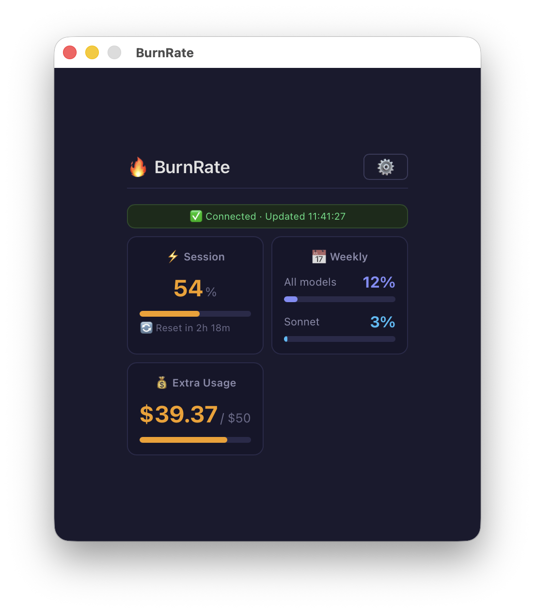

# 🔥 BurnRate

A macOS menu bar app that tracks your Claude Pro usage in real-time — session limits, weekly caps, and extra usage costs at a glance.



## Why?

Claude Pro has usage limits that reset on different schedules. You're mid-conversation, deep in thought — then suddenly rate-limited. BurnRate sits in your menu bar so you always know where you stand.

## Features

- **Menu bar at a glance**: `⚡41% 3h01m | 🔋11%` — session usage, reset countdown, weekly usage
- **Dashboard**: Click to see detailed breakdown with visual progress bars
- **Session tracking**: Current session usage % with countdown to reset
- **Weekly tracking**: All models + Sonnet-specific usage
- **Extra usage**: Monthly spend vs limit (e.g. `$39.37 / $50.00`)
- **Background polling**: Auto-updates every 60 seconds
- **Zero config**: Just log in to Claude once — no API keys needed
- **Lightweight**: Native macOS app via Tauri, minimal CPU/memory

## How It Works

BurnRate opens a hidden browser window, authenticates with your Claude account, and reads usage data from `claude.ai/settings/usage`. The window stays offscreen — you never see it.

1. Launch BurnRate → appears in menu bar
2. First launch: Claude login window appears → sign in once
3. Done! Usage data auto-refreshes in the background

## Menu Bar Format

```
⚡41% 3h01m | 🔋11%
│  │    │       │
│  │    │       └─ Weekly all-models usage
│  │    └───────── Time until session reset
│  └────────────── Session usage percentage
└───────────────── Session indicator

After 3 failed polls:
⚠️ Login required      ← Click tray → Login to Claude
```

## Dashboard

| Card | Shows |
|------|-------|
| **Session Limit** | Usage %, reset countdown, visual bar |
| **Weekly (All Models)** | Combined usage across all Claude models |
| **Weekly (Sonnet)** | Sonnet-specific usage tracking |
| **Extra Usage** | Monthly spend vs limit (e.g. $39.37 / $50.00) |

## Install

### Download (macOS Apple Silicon)

Grab `BurnRate_0.1.0_aarch64.dmg` from [Releases](https://github.com/erados/burnrate/releases).

> ⚠️ **First launch**: Right-click → Open (or System Settings → Privacy → allow). The app is not notarized yet.

### Build from source

```bash
# Prerequisites: Rust, Node.js 18+
cd frontend
npm install
npx tauri build
```

Output: `frontend/src-tauri/target/release/bundle/macos/BurnRate.app`

## Settings

Click tray icon → Dashboard → ⚙️ Settings:

- **Poll interval**: 30s / 1min / 2min / 5min
- **Login to Claude**: Opens visible login window
- **Logout**: Clears session, stops polling

## Privacy & Security

- **100% local** — no external servers, no telemetry
- **No API keys** — uses browser session cookie only
- **No stored passwords** — auth handled by Claude's own login
- Claude session lives in an isolated macOS WebView (WKWebView)
- ⚠️ This app scrapes claude.ai — technically against Anthropic's ToS. Use at your own risk.

## Tech Stack

- **[Tauri v2](https://tauri.app)** — Rust + native WebView, ~5MB bundle
- **[Svelte](https://svelte.dev)** — Dashboard UI
- **Rust** — Polling loop, tray management, scraping coordination
- **Custom URL scheme** — `burnrate://result/<base64>` for WebView → Rust IPC

## Known Issues

- Intel Mac build not yet available (ARM/Apple Silicon only)
- Login cookies may not persist after macOS restart (WKWebView limitation)
- Window briefly appears during initial login flow

## License

MIT

---

Built with ☕ in Brisbane, Australia
